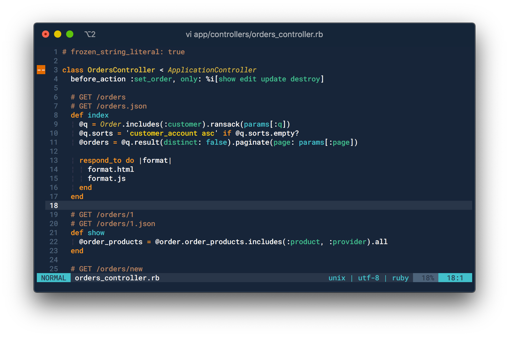

# Hivacruz Vim Theme

_hivacruz_ is a work in progress dark blue GUI color scheme for Vim and Neovim.



> The font used in the screenshot is [Roboto Mono Nerd Font](https://github.com/ryanoasis/nerd-fonts/blob/master/patched-fonts/RobotoMono/Regular/complete/Roboto%20Mono%20Nerd%20Font%20Complete.ttf), Medium, 12px, on iTerm2 Terminal.

## Color Palette


## Prerequisites

_hivacruz_ is a **GUI-only** Vim color scheme, for now.

A GUI client, such as gvim, or a modern terminal version of Vim/Neovim with `termguicolors` enabled in a true-color terminal, will be required. Details about true-color terminals are listed below.

_hivacruz_ explicitly does **not** support the 256 color `cterm` version of Vim due to the number of custom colors required. It might in the future.

If you want to know if your Terminal supports 24-bit color, run the following snippet in your shell:

```
printf "\x1b[38;2;255;100;0mTRUECOLOR\x1b[0m\n"
```

If your terminal emulator **does NOT display the word `TRUECOLOR` in red**, it does not support 24-bit color.

## Installation

This theme follows the standard runtime path structure, and as such it can be installed with a variety of plugin managers:

| Plugin Manager                                       | Install with...                                              |
| ---------------------------------------------------- | ------------------------------------------------------------ |
| [NeoBundle](https://github.com/Shougo/neobundle.vim) | `NeoBundle 'kinoute/vim-hivacruz-theme'`                     |
| [Vundle](https://github.com/VundleVim/Vundle.vim)    | `Plugin 'kinoute/vim-hivacruz-theme'`                        |
| [Plug](https://github.com/junegunn/vim-plug)         | `Plug 'kinoute/vim-hivacruz-theme'`                          |
| [Dein](https://github.com/Shougo/dein.vim)           | `call dein#add('kinoute/vim-hivacruz-theme')`                |
| [minpac](https://github.com/k-takata/minpac/)        | `call minpac#add('kinoute/vim-hivacruz-theme')`              |
| manual                                               | Clone the repo and copy all of the files into your `~/.vim` directory. |

Then:

1. Run `:PlugInstall` on vim after you added the correct line related to your Plugin Manager in `.vimrc` ;
2. Verify that you have enabled the syntax highlighting with `syntax enable` or `syntax on` ;
3. Add/change your `colorscheme` to `colorscheme hivacruz` in your `.vimrc`. Make sure this line appears **after** your Plugin Manager lists the plugins installed ;
4. Add `set termguicolors` on top of your `.vimrc`, otherwise the theme might not work correctly.

## Languages supported

Most of the (Neo)vim languages will have syntax highlighting working out of the box. 

To have a better syntax highlighting experience, I **highly recommend** to install the [vim-polyglot](https://github.com/sheerun/vim-polyglot) plugin. This plugin adds a lot of syntax highlighting for hundreds of languages and this theme depends on it to provide a better set of colors.

Install it with your Plugin manager like this (example here with Vundle):

```vim
Plugin 'sheerun/vim-polyglot'
```

## Lightline & Airline

This theme also has support for [lightline](https://github.com/itchyny/lightline.vim) as well as [airline](https://github.com/vim-airline/vim-airline).

To enable lightline support:

```vim
let g:lightline = {'colorscheme' : 'hivacruz'}
```

Or to enable airline support:

```vim
let g:airline_theme='hivacruz'
let g:airline_powerline_fonts = 1
```

The lightline and airline styles will both follow the chosen colors cheme style.

## Plugins explicity styled

As today,  the following plugins have been styled (more to come):

- [airline](https://github.com/vim-airline/vim-airline)
- [ALE](https://github.com/w0rp/ale)
- [GitGutter](https://github.com/airblade/vim-gitgutter)
- [indentLine](https://github.com/Yggdroot/indentLine)
- [lightline](https://github.com/itchyny/lightline.vim)
- [NERDTree](https://github.com/scrooloose/nerdtree)

## True Color Terminals

Many modern terminals support [24-bit true colors](https://gist.github.com/XVilka/8346728). Current versions of Vim and Neovim on such terminals support true colors when `set termguicolors` is enabled.

A list of popular terminals that support true colors:

- [iTerm2](http://www.iterm2.com) (see my personal theme below)
- [GNOME Terminal](https://wiki.gnome.org/Apps/Terminal)
- [Windows Terminal](https://github.com/Microsoft/Terminal)
- [Alacritty](https://github.com/alacritty/alacritty)
- [kitty](https://sw.kovidgoyal.net/kitty/index.html)
- [konsole](https://konsole.kde.org)
- [PuTTY](https://putty.org)
- [mintty](https://mintty.github.io)

On terminals that support true colors, and when `termguicolors` is set, the _hivacruz_ color scheme will emit the correct theme colors.

For the _hivacruz_ color scheme to display correctly inside _tmux_ the following setting will usually be required in `~/.tmux.conf`:

```
set -ga terminal-overrides ',xterm-256color:Tc'
```

Vim, as against Neovim, inside _tmux_, will also require the following setting be added to `.vimrc`:

```viml
let &t_8f = "\<Esc>[38;2;%lu;%lu;%lum"let &t_8b = "\<Esc>[48;2;%lu;%lu;%lum"
```

## Contributing

Since it is a work in progress, if you find something buggy or you simply want to help in order to improve the theme, please don't hesitate to submit Pull Requests or write issues!

## Screenshots

Some examples of syntax highlighting:

### Ruby


### JavaScript


### CSS


### PHP


### Yaml


### Bash


The font used is [Roboto Mono Nerd Font](https://github.com/ryanoasis/nerd-fonts/blob/master/patched-fonts/RobotoMono/Regular/complete/Roboto%20Mono%20Nerd%20Font%20Complete.ttf), Medium, 12px, on iTerm2 Terminal.

## Same theme in other apps

I made similar themes with the same colours for different applications. Here there are:

- Sublime Text theme: https://github.com/kinoute/hivacruz-sublime-theme
- VSCode Theme: https://github.com/kinoute/vscode-hivacruz-theme
- iTerm2: https://github.com/kinoute/hivacruz-itermcolors
- Nova: https://github.com/kinoute/hivacruz-nova-theme
- Typora Theme: https://github.com/kinoute/typora-hivacruz-theme

## Credits

- Created by [Yann Defretin](https://github.com/kinoute).
- Colors inspired by Coda 2.5's Panic Palette by Cabel Sasser.
- The README was written by using the [vim-nightfly-guicolors](https://github.com/bluz71/vim-nightfly-guicolors) README as a start.

